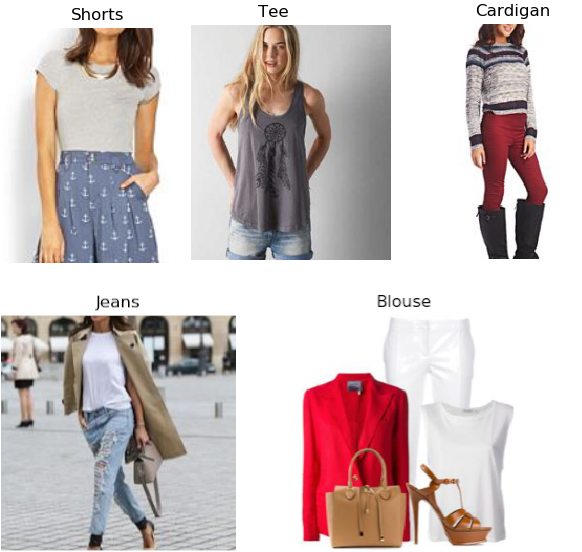

# Requirements
conda env create -f environment.yml

# Train
```python
python train.p -i PATH_TO_DEEP_FASHION_DATASET
```

# find similar images
```python
python extractor.py -i PATH_TO_DEEP_FASHION_DATASTE
```

# Problems
- __Missing labels__: DeepFashion labels one cloth category per image, but there are often more than one type of cloth in images
with model. This might cause the problems for the models to learn distinguished features for each category. Below are several samples
that I picked up from the dataset.

 

# Articles
- https://research.zalando.com/welcome/mission/research-projects/improving-fashion-item-encoding-and-retrieval/