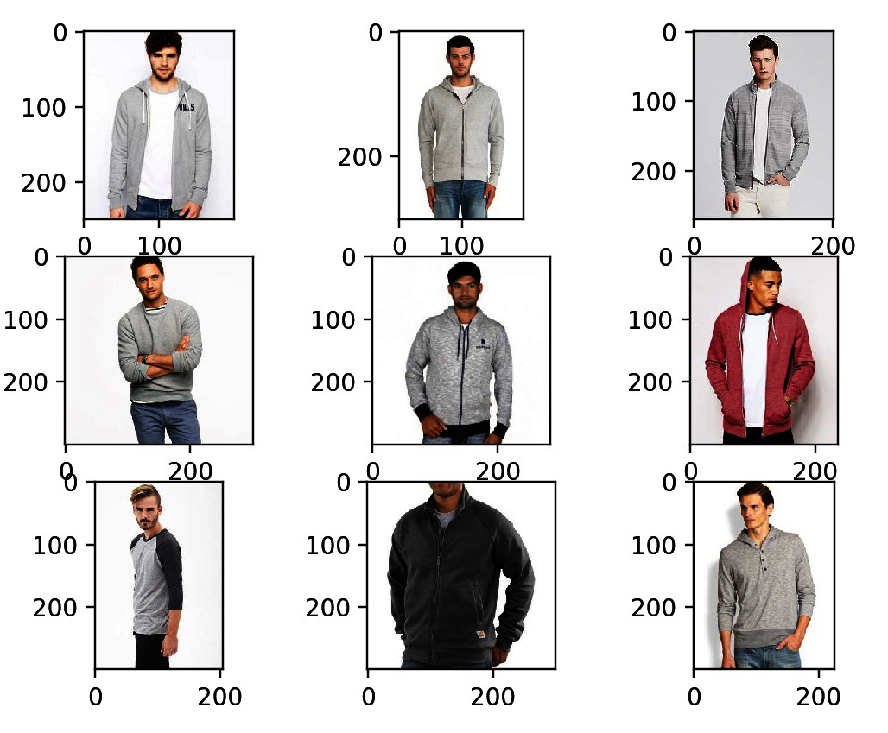
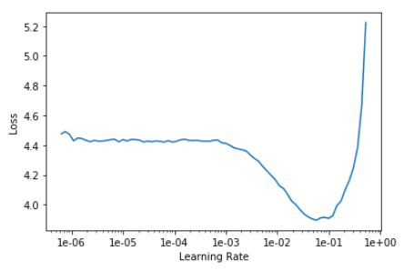
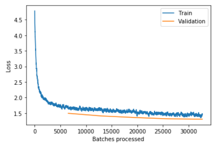
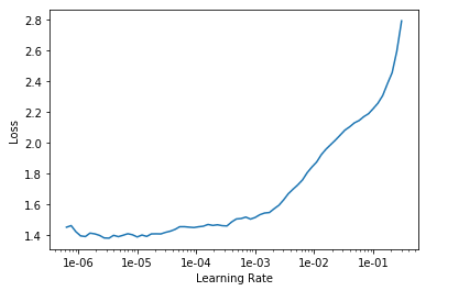
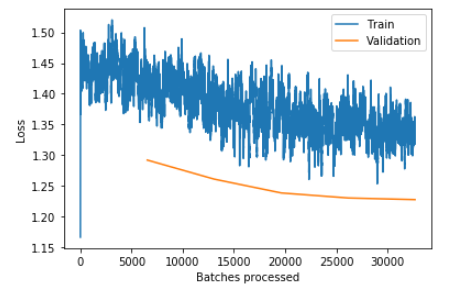
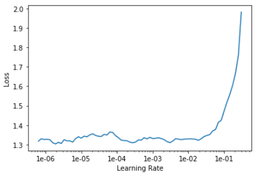
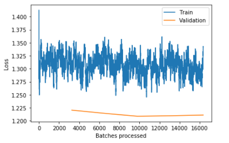
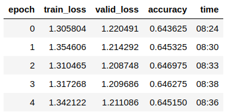
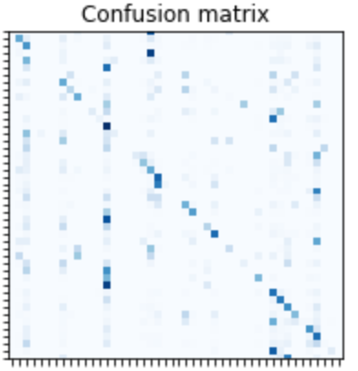

# requirements
conda env create -f environment.yml

# training
run jupyter noteobook train.ipynb
with this option, it is possible to monitor the traning graph overtime and choose appropriate learning rate.
For more detail about the training process and the selection of hypterparameters, please check the
[training note](#Training-details)

# similar images retrieval
this code performs the following stages to find similar images for each clothes image.
- extract feature vector for all images
- build a K-nearnest-neighbor tree from all the extracted features.
- for each image, query the tree for K nearest neighbor features.
```python
python measure_sim.py -i PATH_TO_DEEP_FASHION_DATASTE --ouput_dir DIR_FOR_KNN_RESULT
```
below are several sample results. The top-left image is the query images and the remaining ones
are the retrieved images.




# Problems

- __Missing labels__: DeepFashion labels one cloth category per image, but there are often more than one type of cloth in images
with model. This might cause the problems for the models to learn distinguished features for each category. Below are several samples
that I picked up from the dataset.


## training note
__step 1__: 

find learning rate. In the below graph, the learning rate of $1e-2$ is used, which is
the location the loss decreases at the strongest rate.



freeze the resnet encoder and fit the head of the network for 5 cycles. Below are the learning graph losses over
5 cycles.



__step 2__:

unfreeze the whole network and again, find the new learning rate. This time, I chose the learning rate as $1e-5/2$ 
because at this location, the downward loss slop is strongest.



fine-tune the whole network for 5 more cycles.



__step 3__:
train model with larger image size
again, find one appropriate learning rate


and we keep training the head for 5 more cycles. Fro the loss graph, there is a hint that the validation loss
starts increasing, so we stop the training here and save the best model so far.



# Result
accuracy



confusion matrix



# Articles
- https://research.zalando.com/welcome/mission/research-projects/improving-fashion-item-encoding-and-retrieval/